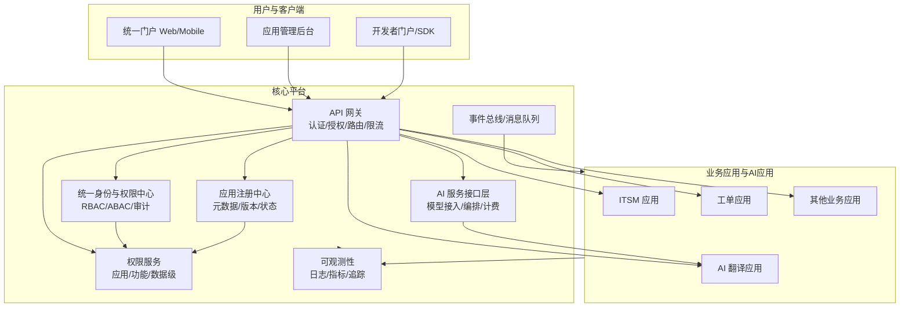

# Inhouse 企业级内部集成系统设计

## 1. 系统架构图（Mermaid）



## 2. 核心模块设计

### 2.1 统一用户授权管理（RBAC + 细粒度权限）
- **身份与权限中心（IAM）**
  - 统一认证：支持 SSO、OIDC、LDAP/AD。
  - 角色与用户管理：用户、角色、组织/部门的层级关系。
  - 审计日志：登录、权限变更、关键操作追踪。
- **权限服务（PermissionSvc）**
  - RBAC 作为基础模型，结合 ABAC（属性驱动）实现数据级权限。
  - 权限模型：
    - 应用级：是否可访问某应用（App）。
    - 功能级：是否可使用特定功能（Feature）。
    - 数据级：是否可访问某数据对象（Resource + Policy）。
  - 权限校验策略：
    - 网关层统一鉴权（JWT/Access Token + Policy）。
    - 应用内部再次校验（防止越权访问）。
- **用户可见应用控制**
  - 通过 AppRegistry + PermissionSvc 动态返回“可见应用列表”。
  - 前端门户仅展示用户有权应用与功能入口。

### 2.2 AI 能力集成（AIHub）
- **统一 AI 服务接口层**
  - 统一请求标准（模型调用、参数、超时、错误码）。
  - 支持多模型服务：自研模型、第三方 API 等。
- **可扩展性**
  - 插件式模型注册：新增模型只需注册配置与适配器。
  - 统一接口：`/ai/{provider}/{model}/invoke`。
- **应用分类**
  - AI 应用作为应用体系的一类，通过应用注册中心统一管理。

### 2.3 多应用集成框架
- **应用注册中心（AppRegistry）**
  - 存储应用元数据（名称、版本、状态、入口 URL、能力描述）。
  - 支持版本控制与灰度配置。
- **应用解耦**
  - 各应用独立部署。
  - 应用间通过事件总线/服务调用解耦。
  - 单个应用故障不影响整体。

### 2.4 应用管理后台
- **功能**
  - 注册/修改应用元数据。
  - 应用状态管理（启用/禁用）。
  - 版本控制与灰度发布。
  - 权限分配：应用与角色绑定。
- **界面示例功能**
  - 应用列表、详情页、权限矩阵配置。

### 2.5 系统架构与运维支持
- **微服务/插件化架构**
  - 核心系统与业务应用解耦。
  - AIHub 可作为独立服务集群。
- **API 网关**
  - 统一认证、授权、请求路由、限流。
- **高可用与扩展性**
  - 核心服务水平扩展。
  - 多活/容灾部署。
- **监控与故障隔离**
  - 服务健康检查、熔断、降级。
  - 统一监控（Prometheus + Grafana）。

## 3. 关键技术选型建议

- **基础技术栈**：Java 8 + MySQL + 微服务架构（Spring Boot/Spring Cloud 体系）。
- **网关与服务治理**：统一 API 网关、服务注册发现、配置中心、限流熔断。
- **可观测性**：日志、指标、链路追踪的统一平台化能力。

## 4. 应用集成流程说明

1. **应用开发**
   - 使用 SDK 开发并实现标准接口。
   - 接入统一认证（JWT/OIDC）。

2. **应用注册**
   - 在应用管理后台注册应用元数据。
   - 填写应用入口 URL、版本、描述。

3. **权限配置**
   - 在管理后台为应用分配角色。
   - 可配置功能级、数据级权限。

4. **发布与启用**
   - 应用状态切换为“启用”。
   - 网关路由生效，用户可见。

5. **运行与监控**
   - 自动纳入监控与健康检查。
   - 若应用异常触发熔断，隔离故障。

## 5. 应用开发规范与 SDK 说明
- **接口规范**
  - 标准化 API（OpenAPI/Swagger）。
  - 统一错误码和响应结构。
- **SDK 功能**
  - 统一鉴权客户端。
  - 应用健康检查与指标采集。
  - 调用 AIHub 的封装接口。

## 6. 结论
该系统通过 **统一权限中心 + AIHub + 应用注册管理**，实现企业级集成平台的可扩展、可管理、可运维能力，满足多应用集成、AI能力扩展以及安全合规要求。

## 7. 应用注册 + 权限模型（接口草案与表结构草图）

### 7.1 应用注册（AppRegistry）接口草案

**应用管理**
- `POST /api/apps`：注册应用
- `GET /api/apps`：应用列表（支持按状态/标签过滤）
- `GET /api/apps/{appId}`：应用详情
- `PATCH /api/apps/{appId}`：更新应用信息（入口 URL/版本/描述/状态）
- `POST /api/apps/{appId}/status`：启用/禁用应用
- `POST /api/apps/{appId}/routes/refresh`：刷新网关路由

**应用版本与环境**
- `POST /api/apps/{appId}/versions`：新增版本（灰度/发布策略）
- `GET /api/apps/{appId}/versions`：版本列表
- `POST /api/apps/{appId}/envs`：配置环境（dev/test/prod）与入口地址

**应用功能（Feature）**
- `POST /api/apps/{appId}/features`：新增功能点
- `GET /api/apps/{appId}/features`：功能点列表
- `PATCH /api/apps/{appId}/features/{featureId}`：更新功能点
- `POST /api/apps/{appId}/features/{featureId}/status`：启用/禁用功能点

**示例：注册应用**
```json
POST /api/apps
{
  "code": "ticket",
  "name": "工单系统",
  "ownerOrgId": "org-001",
  "entryUrl": "https://ticket.example.com",
  "status": "ENABLED",
  "tags": ["ITSM", "core"],
  "description": "内部工单与审批"
}
```

### 7.2 权限模型接口草案

**角色与授权**
- `POST /api/roles`：创建角色
- `GET /api/roles`：角色列表
- `POST /api/roles/{roleId}/permissions`：给角色绑定权限
- `GET /api/roles/{roleId}/permissions`：角色权限详情

**用户授权**
- `POST /api/users/{userId}/roles`：用户绑定角色
- `GET /api/users/{userId}/permissions`：用户聚合权限（可用于前端展示）

**鉴权校验**
- `POST /api/permissions/check`：后端服务鉴权校验（网关/应用调用）
```json
POST /api/permissions/check
{
  "userId": "u-1001",
  "appCode": "ticket",
  "featureCode": "ticket.create",
  "resourceType": "ticket",
  "resourceId": "T-20240401",
  "action": "create",
  "attributes": {
    "deptId": "d-001",
    "region": "cn"
  }
}
```

### 7.3 数据库表结构草图（MySQL）

**应用注册**
```
app_registry (
  id BIGINT PK,
  code VARCHAR(64) UNIQUE,
  name VARCHAR(128),
  description VARCHAR(512),
  owner_org_id VARCHAR(64),
  entry_url VARCHAR(512),
  status VARCHAR(32),
  tags VARCHAR(256),
  created_at DATETIME,
  updated_at DATETIME
)

app_version (
  id BIGINT PK,
  app_id BIGINT FK,
  version VARCHAR(64),
  status VARCHAR(32),
  rollout_strategy VARCHAR(64),
  created_at DATETIME
)

app_env (
  id BIGINT PK,
  app_id BIGINT FK,
  env VARCHAR(32),
  entry_url VARCHAR(512),
  status VARCHAR(32),
  created_at DATETIME,
  updated_at DATETIME
)

app_feature (
  id BIGINT PK,
  app_id BIGINT FK,
  code VARCHAR(128),
  name VARCHAR(128),
  description VARCHAR(512),
  status VARCHAR(32),
  created_at DATETIME,
  updated_at DATETIME
)
```

**权限与授权**
```
iam_role (
  id BIGINT PK,
  code VARCHAR(64) UNIQUE,
  name VARCHAR(128),
  description VARCHAR(512),
  created_at DATETIME,
  updated_at DATETIME
)

iam_user (
  id BIGINT PK,
  username VARCHAR(64) UNIQUE,
  display_name VARCHAR(128),
  org_id VARCHAR(64),
  status VARCHAR(32),
  created_at DATETIME,
  updated_at DATETIME
)

iam_user_role (
  user_id BIGINT FK,
  role_id BIGINT FK,
  created_at DATETIME,
  PRIMARY KEY (user_id, role_id)
)

permission (
  id BIGINT PK,
  app_id BIGINT FK,
  feature_id BIGINT FK,
  resource_type VARCHAR(64),
  action VARCHAR(64),
  condition_json JSON,
  created_at DATETIME
)

role_permission (
  role_id BIGINT FK,
  permission_id BIGINT FK,
  created_at DATETIME,
  PRIMARY KEY (role_id, permission_id)
)
```

### 7.4 关联关系与落地说明
- **AppRegistry** 与 **Permission** 通过 `app_id` 关联，功能级权限通过 `feature_id` 关联。
- **RBAC**：`iam_user -> iam_user_role -> iam_role -> role_permission -> permission`。
- **ABAC**：`permission.condition_json` 存放策略条件（如部门/地域/数据级标签）。
- **应用可见性**：查询用户权限聚合后，仅返回有 `app_id` 权限的应用列表。
